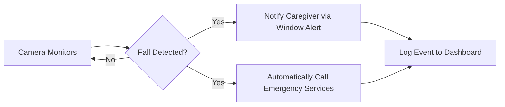
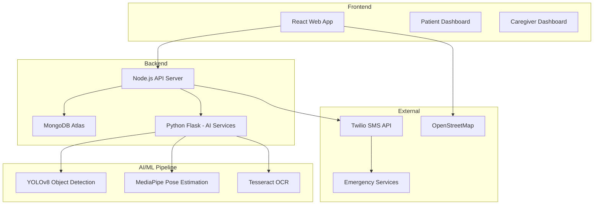
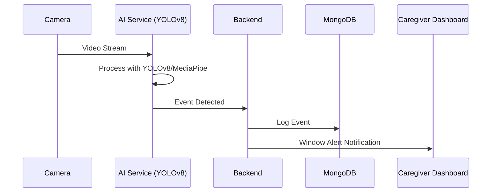

# AgeWell - Product Requirements Document

## 1. Executive Summary

**Product Name:** AgeWell  
**Version:** 1.1  
**Date:** January 20, 2026  

AgeWell is a relationship-strengthening elderly care platform that replaces intrusive supervision with respectful, autonomy-preserving support. The system enables care to be delivered in ways that align with the recipient's needs, preferences, and dignity—while reducing caregiver stress and emotional friction.

Using computer vision and intelligent automation, AgeWell analyzes an elderly person's activities, provides timely reminders, and alerts caregivers only when genuinely needed. This approach transforms care from constant checking into a partnership built on trust.

> **Core Philosophy:** Care is delivered when needed, not constantly imposed.

---

## 2. Product Philosophy

AgeWell is built on four foundational principles that differentiate it from traditional monitoring solutions:

### 2.1 From Constant Checking → Trust & Autonomy

| Traditional Approach | AgeWell Approach |
|---------------------|------------------|
| Care recipients feel monitored, nagged, or controlled | Passive monitoring replaces intrusive check-ins |
| Caregivers feel anxious and overburdened | Caregivers intervene only when genuinely needed |
| Leads to tension, guilt, and loss of dignity | Care recipients retain independence in daily routines |

**Outcome:** Less nagging. More trust. Care feels supportive, not controlling.

### 2.2 Aligning Care With What the Recipient Actually Wants

| Traditional Approach | AgeWell Approach |
|---------------------|------------------|
| Caregivers act based on fear ("What if something happens?") | Daily checklists reflect the recipient's real routines |
| Recipients feel their preferences are ignored | Voice reminders are supportive, not disciplinary |
| Mismatch between care provided vs care desired | Navigation/help options let recipients choose their assistance |

**Outcome:** Care is personalised, not paternalistic. Recipients feel heard and respected.

### 2.3 Reducing Emotional Burnout on Both Sides

| Traditional Approach | AgeWell Approach |
|---------------------|------------------|
| Caregivers experience constant cognitive load and guilt | Automated alerts replace mental tracking |
| Care recipients sense stress and feel like a burden | Summaries remove the need for repeated explanations |
| Emotionally charged crisis moments | Emergency handling is decisive, not chaotic |

**Outcome:** Emotional bandwidth is freed for connection, not crisis management.

### 2.4 Preserving Dignity Through Invisible Support

| Traditional Approach | AgeWell Approach |
|---------------------|------------------|
| Visible supervision damages dignity | Background systems handle safety quietly |
| Asking for help feels like admitting failure | Care recipients only engage when they choose to |
| Must repeatedly "prove" competence | No need to demonstrate capability constantly |

**Outcome:** Care becomes a partnership, not a hierarchy. Recipients feel capable, not infantilised.

---

## 3. Problem Statement

### The Challenge
Life becomes more difficult for the elderly—and also more difficult for their caregivers. The challenges are both practical and emotional:

| Challenge | Practical Impact | Emotional Impact |
|-----------|-----------------|------------------|
| **Falls** | Leading cause of injury and death in elderly | Fear and anxiety for both parties |
| **Memory Loss** | Forgotten medications, meals, hydration | Frustration and repeated conflicts |
| **Getting Lost** | Inability to navigate or call for help | Loss of independence and confidence |
| **Communication Gaps** | Delayed emergency response | Guilt and worry for caregivers |
| **Constant Supervision** | Caregiver burnout | Recipients feel like a burden |

### The Opportunity
AgeWell aims to ease this pain by minimizing the risks of memory loss and dangerous situations while preserving the dignity and autonomy of care recipients:

- Replace intrusive check-ins with passive, respectful monitoring
- Automate emergency detection and decisive response
- Provide intelligent reminders that support rather than nag
- Enable remote caregiving without constant in-person presence
- Generate health insights that facilitate better medical care

---

## 4. Target Users

### Primary Users

#### 4.1 Elderly Care Recipients
- **Demographics:** 65+ years old
- **Conditions:** Alzheimer's, dementia, general age-related memory decline
- **Needs:** Simple interface, voice guidance, emergency assistance, preservation of dignity
- **Tech Literacy:** Low to moderate
- **Key Insight:** Recipients want to feel capable and independent, not monitored or controlled

#### 4.2 Caregivers
- **Role:** Family members, professional caregivers, or nursing staff
- **Needs:** Remote check-ins without being physically present, instant alerts, activity history
- **Tech Literacy:** Moderate to high
- **Key Insight:** Caregivers want peace of mind without constant anxiety or guilt

#### 4.3 Healthcare Providers
- **Role:** Primary care physicians, geriatric specialists
- **Needs:** Health trend summaries, behavioral reports for appointments
- **Interaction:** Periodic report consumption to facilitate better medical discussions

---

## 5. Core Features

### 5.1 Computer Vision Activity Analysis 📹
**Priority:** Critical | **Philosophy:** Invisible Support

AgeWell uses computer vision to analyze an elderly person's activities passively, without requiring any action from the care recipient.

| Aspect | Details |
|--------|---------|
| **Description** | Real-time analysis of daily activities using camera monitoring |
| **Technology** | YOLOv8 object detection + MediaPipe pose estimation |
| **Activities Detected** | Eating meals, taking pills, drinking water, falls |
| **Dashboard Integration** | Automatically updates caregiver dashboard with activity status |
| **Notifications** | Window alerts displayed when activities are completed or missed |

---

### 5.2 Fall Detection & Emergency Response 🚨
**Priority:** Critical | **Philosophy:** Decisive Action

| Aspect | Details |
|--------|---------|
| **Description** | Automatic detection of falls with immediate emergency response |
| **Technology** | YOLOv8 + MediaPipe pose estimation |
| **Response** | Automatically calls emergency services + notifies caregiver via window alert |
| **Accuracy Target** | >95% detection rate, <5% false positive rate |

**User Flow:**

---

### 5.3 Navigation Assistance 🗺️
**Priority:** High | **Philosophy:** Recipient Choice

| Aspect | Details |
|--------|---------|
| **Description** | Intuitive GPS navigation for elderly users who are lost outside |
| **Interface** | Large buttons: "Navigation to take you home" / "Request Help" |
| **Technology** | Leaflet + OpenStreetMap integration |
| **Audio Feedback** | Voice guidance with directions + confirmation on arrival |
| **Help Mode** | Alerts caregiver, shares live location |

**Key Experience Elements:**
- Turn-by-turn directions displayed on screen
- Audio feedback: *"Follow the directions on screen"*
- Arrival confirmation: *"Great job! You have arrived home safely."*
- Caregiver notification sent when user initiates "lost" mode

**User Interface Requirements:**
- Minimum 48px touch targets
- High contrast colors
- Voice guidance for all navigation steps
- One-tap emergency button

---

### 5.4 Daily Task Checklists ✅
**Priority:** High | **Philosophy:** Personalized Care

| Aspect | Details |
|--------|---------|
| **Description** | Trackable daily routines connected to camera feature |
| **Categories** | Medications, meals, hydration, personal care |
| **Detection** | Computer vision automatically recognizes task completion |
| **Dashboard** | Checklist automatically updates with completion status |
| **Alerts** | Notifies caregiver via dashboard + window alert if tasks are skipped |

**Default Task Categories:**
1. **Medications** - Morning, afternoon, evening doses (with pill verification)
2. **Meals** - Breakfast, lunch, dinner
3. **Hydration** - Water intake tracking
4. **Activities** - Exercise, social interaction

**Key Features:**
- Real-time percentage of daily tasks completed
- Automatic updates without manual input from care recipient
- Caregiver can view full activity timeline

---

### 5.5 Voice Reminders 🔊
**Priority:** Medium | **Philosophy:** Supportive, Not Disciplinary

| Aspect | Details |
|--------|---------|
| **Description** | Automated supportive audio reminders for daily tasks |
| **Triggers** | Scheduled times + missed task detection |
| **Tone** | Helpful and encouraging, not nagging or controlling |
| **Medication Safety** | Ensures correct pills at correct times |

**Example Reminder:**
> *"It is Saturday dinner. Make sure to take the right pill."*

**Key Principles:**
- Reminders support recipients, not discipline them
- Prevents medication errors (wrong pill, wrong time)
- Respects recipient's autonomy while ensuring safety

---

### 5.6 Medical Summaries & Trend Analysis 📋
**Priority:** Medium | **Philosophy:** Reducing Explanations

| Aspect | Details |
|--------|---------|
| **Description** | Auto-generated health reports analyzing patterns over time |
| **Trend Analysis** | Detects if person is generally skipping meals or not taking pills |
| **Purpose** | Facilitates meetings with primary care providers |
| **Frequency** | Weekly summaries + pre-appointment reports |
| **Delivery** | Email to registered healthcare provider |

**Key Insights Generated:**
- Pattern detection (e.g., "consistently skipping lunch")
- Medication adherence trends
- Activity level changes over time
- Fall incidents and near-misses

**Benefit:** Removes need for repeated explanations during medical appointments.

---

### 5.7 Constant Location Tracking 📍
**Priority:** Medium | **Philosophy:** Background Safety

| Aspect | Details |
|--------|---------|
| **Description** | Continuous GPS tracking visible on caregiver dashboard |
| **Visibility** | Caregivers can see location at any time |
| **Privacy** | Background feature—recipient doesn't need to interact |
| **Alerts** | Notifications if recipient leaves designated safe zones |

---

## 6. Technical Architecture

### 6.1 System Overview

### 6.2 Technology Stack

| Layer | Technology | Purpose |
|-------|------------|---------|
| **Frontend** | React 18 + Vite | Web application |
| **Styling** | Tailwind CSS | Responsive, accessible UI |
| **Mapping** | Leaflet + OpenStreetMap | GPS navigation |
| **Backend API** | Node.js | REST API, business logic |
| **AI Services** | Python Flask | ML model serving |
| **Database** | MongoDB Atlas | Data persistence |
| **Object Detection** | YOLOv8 | Fall detection, activity recognition |
| **Pose Estimation** | MediaPipe | Body posture analysis |
| **OCR** | Tesseract | Medication label reading |
| **Communication** | Window Alerts | In-app notifications |

### 6.3 Data Flow

---

## 7. User Interface Requirements

### 7.1 Patient Interface

> [!IMPORTANT]
> The patient interface must prioritize accessibility and simplicity for users with cognitive impairments.

**Design Principles:**
- **Large touch targets** (minimum 48x48px)
- **High contrast colors** (WCAG AAA compliance)
- **Minimal cognitive load** (max 3 options per screen)
- **Voice guidance** for all interactions
- **No typing required** for core functions

### 7.2 Caregiver Dashboard

**Features:**
- Real-time patient status overview
- Activity timeline with timestamps
- Alert history and acknowledgment
- Task checklist management
- GPS location tracking
- Report generation

### 7.3 Mobile Responsiveness
- Full functionality on tablets and mobile devices
- Touch-optimized interactions
- Offline capability for critical features

---

## 8. Security & Privacy

### 8.1 Data Protection

| Measure | Implementation |
|---------|----------------|
| **Encryption** | AES-256 at rest, TLS 1.3 in transit |
| **Authentication** | JWT tokens, optional biometric |
| **Authorization** | Role-based access control (RBAC) |
| **Data Retention** | Configurable, default 90 days |
| **HIPAA Compliance** | Required for US deployment |

### 8.2 Privacy Considerations
- Camera feeds processed locally when possible
- Minimal data collection principle
- User consent for all data sharing
- Transparent data usage policies

---

## 9. Performance Requirements

| Metric | Target |
|--------|--------|
| **Fall Detection Latency** | < 2 seconds |
| **SMS Alert Delivery** | < 5 seconds |
| **Page Load Time** | < 3 seconds |
| **System Uptime** | 99.9% |
| **Video Processing FPS** | ≥ 15 FPS |
| **Database Query Response** | < 100ms |

---

## 10. Success Metrics

### 10.1 Key Performance Indicators (KPIs)

| Metric | Target | Measurement |
|--------|--------|-------------|
| **Fall Detection Accuracy** | >95% | True positive rate |
| **False Alarm Rate** | <5% | False positive rate |
| **Emergency Response Time** | <30 seconds | Alert to acknowledgment |
| **Daily Active Users** | >80% | Patient engagement |
| **Caregiver Satisfaction** | >4.5/5 | NPS surveys |
| **Task Completion Rate** | >85% | Checklist completion |

### 10.2 Relationship Outcomes
- Reduction in fall-related hospitalizations
- Improved medication adherence
- **Decreased caregiver burnout and anxiety**
- **Improved caregiver-recipient relationship quality**
- **Maintained dignity and autonomy for care recipients**
- Earlier detection of health decline patterns

---

## 11. Development Phases

### Phase 1: MVP (Months 1-3)
- [ ] Core fall detection
- [ ] Basic caregiver alerts (SMS)
- [ ] Simple patient dashboard
- [ ] MongoDB data storage

### Phase 2: Enhanced Features (Months 4-6)
- [ ] Daily task checklists
- [ ] Voice reminders
- [ ] Caregiver dashboard
- [ ] Activity logging

### Phase 3: Navigation & Reports (Months 7-9)
- [ ] GPS navigation assistance
- [ ] Medical summary generation
- [ ] Healthcare provider portal
- [ ] Advanced analytics

### Phase 4: Optimization (Months 10-12)
- [ ] Performance optimization
- [ ] Mobile app development
- [ ] Multi-language support
- [ ] Integration APIs

---

## 12. Risks & Mitigations

| Risk | Impact | Probability | Mitigation |
|------|--------|-------------|------------|
| False positive falls | User trust erosion | Medium | ML model refinement, user feedback loop |
| Network outages | Missed emergencies | Low | Local processing, offline mode |
| Privacy concerns | Adoption resistance | Medium | Transparent policies, local processing |
| Technology complexity for users | Low adoption | High | Extensive UX testing, voice guidance |
| HIPAA non-compliance | Legal issues | Medium | Early compliance audit, secure architecture |

---

## 13. Dependencies

### External Services
- **Window Alerts** - In-app browser notifications
- **OpenStreetMap** - Mapping and navigation
- **MongoDB Atlas** - Cloud database

### Hardware Requirements
- Camera with minimum 720p resolution
- Stable internet connection (>5 Mbps)
- Audio output for voice reminders

---

## 14. Future Considerations

- **Wearable Integration** - Smart watch fall detection
- **AI Chatbot** - Companion for loneliness reduction
- **Predictive Analytics** - Early warning for health decline
- **Multi-patient Dashboard** - For professional care facilities
- **Telehealth Integration** - Video consultations

---

## 15. Appendix

### A. Glossary

| Term | Definition |
|------|------------|
| **YOLOv8** | Real-time object detection model |
| **MediaPipe** | Google's ML framework for body tracking |
| **Tesseract** | Open-source OCR engine |
| **HIPAA** | US healthcare data protection regulations |
| **WCAG** | Web Content Accessibility Guidelines |

### B. References
- WHO Fall Prevention Guidelines
- Alzheimer's Association Care Standards
- WCAG 2.1 Accessibility Guidelines
- HIPAA Security Rule

---

*Document maintained by the AgeWell Development Team*
