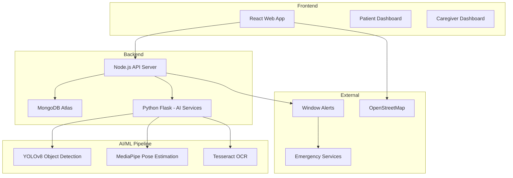

# AgeWell - Elderly Care Platform 🏡

> **Care delivered when needed, not constantly imposed.**

AgeWell is a relationship-strengthening elderly care platform that replaces intrusive supervision with respectful, autonomy-preserving support. Using computer vision and intelligent automation, it provides timely reminders and alerts caregivers only when genuinely needed—transforming care from constant checking into a partnership built on trust.

[](LICENSE)

---

## 📋 Table of Contents

- [Overview](#overview)
- [Core Philosophy](#core-philosophy)
- [Key Features](#key-features)
- [Technology Stack](#technology-stack)
- [Getting Started](#getting-started)
- [Architecture](#architecture)
- [Target Users](#target-users)
- [Success Metrics](#success-metrics)
- [Contributing](#contributing)
- [License](#license)

---

## 🎯 Overview

AgeWell addresses the emotional and practical challenges of elderly care by:
- **Reducing caregiver stress** through automated monitoring and intelligent alerts
- **Preserving dignity and autonomy** for care recipients via passive, respectful monitoring
- **Preventing emergencies** with fall detection and automated response
- **Improving communication** between caregivers, care recipients, and healthcare providers

### The Problem We Solve

| Challenge | Our Solution |
|-----------|--------------|
| **Falls** (leading cause of elderly injury) | Automatic detection + emergency response |
| **Memory Loss** (forgotten medications, meals) | Intelligent reminders + daily checklists |
| **Getting Lost** | GPS navigation with voice guidance |
| **Communication Gaps** | Real-time alerts + medical summaries |
| **Constant Supervision** | Passive monitoring preserving independence |

---

## 💡 Core Philosophy

AgeWell is built on four foundational principles:

### 1. From Constant Checking → Trust & Autonomy
- Passive monitoring replaces intrusive check-ins
- Caregivers intervene only when genuinely needed
- Care recipients retain independence in daily routines

### 2. Aligning Care With What Recipients Actually Want
- Daily checklists reflect real routines
- Voice reminders are supportive, not disciplinary
- Recipients choose their assistance

### 3. Reducing Emotional Burnout on Both Sides
- Automated alerts replace mental tracking
- Summaries remove need for repeated explanations
- Emergency handling is decisive, not chaotic

### 4. Preserving Dignity Through Invisible Support
- Background systems handle safety quietly
- Care recipients engage only when they choose to
- No need to demonstrate capability constantly

---

## ✨ Key Features

### 📹 Computer Vision Activity Analysis
- Real-time analysis of daily activities (eating, medication, drinking water)
- Automatic dashboard updates
- YOLOv8 object detection + MediaPipe pose estimation
- Window alert notifications for caregivers

### 🚨 Fall Detection & Emergency Response
- Automatic fall detection with >95% accuracy
- Immediate emergency service alerts
- Instant caregiver notifications
- Event logging to dashboard

### 🗺️ Navigation Assistance
- GPS navigation for disoriented users
- Large, accessible button interface
- Voice guidance with turn-by-turn directions
- Emergency "Request Help" button with live location sharing

### ✅ Daily Task Checklists
- Trackable medications, meals, hydration, and activities
- Automatic task completion detection via computer vision
- Real-time progress tracking
- Missed task alerts

### 🔊 Voice Reminders
- Supportive, encouraging tone (not disciplinary)
- Scheduled + missed task triggers
- Medication safety confirmations
- Example: *"It is Saturday dinner. Make sure to take the right pill."*

### 📋 Medical Summaries & Trend Analysis
- Auto-generated health reports
- Pattern detection (e.g., skipping meals)
- Medication adherence tracking
- Pre-appointment reports for healthcare providers

### 📍 Constant Location Tracking
- Background GPS monitoring
- Caregiver dashboard integration
- Safe zone alerts
- Privacy-conscious implementation

---

## 🛠️ Technology Stack

| Layer | Technology | Purpose |
|-------|------------|---------|
| **Frontend** | React 18 + Vite | Modern web application |
| **Styling** | Tailwind CSS | Responsive, accessible UI |
| **Mapping** | Leaflet + OpenStreetMap | GPS navigation |
| **Backend API** | Node.js | REST API, business logic |
| **AI Services** | Python Flask | ML model serving |
| **Database** | MongoDB Atlas | Data persistence |
| **Object Detection** | YOLOv8 | Fall detection, activity recognition |
| **Pose Estimation** | MediaPipe | Body posture analysis |
| **OCR** | Tesseract | Medication label reading |
| **Communication** | Window Alerts | In-app notifications |

---

## 🚀 Getting Started

### Prerequisites
- Node.js 18+ and npm
- Python 3.9+
- MongoDB Atlas account
- Camera device (minimum 720p resolution)
- Stable internet connection (>5 Mbps)

### Installation

```bash
# Clone the repository
git clone https://github.com/Ducksss/hack4good.git
cd hack4good

# Install frontend dependencies
npm install

# Install Python dependencies
pip install -r requirements.txt

# Configure environment variables
cp .env.example .env
# Edit .env with your MongoDB URI, API keys, etc.

# Start the development server
npm run dev

# In another terminal, start the AI service
python ai_service.py
```

### Configuration

Create a `.env` file with the following variables:

```env
MONGODB_URI=your_mongodb_atlas_uri
TWILIO_ACCOUNT_SID=your_twilio_sid
TWILIO_AUTH_TOKEN=your_twilio_token
API_PORT=3000
AI_SERVICE_PORT=5000
```

---

## 🏗️ Architecture



### Data Flow

1. **Camera** captures video stream
2. **AI Service** processes with YOLOv8/MediaPipe
3. **Backend** receives event detection
4. **MongoDB** logs the event
5. **Dashboard** displays window alert notification

---

## 👥 Target Users

### Elderly Care Recipients (65+)
- Conditions: Alzheimer's, dementia, memory decline
- Needs: Simple interface, voice guidance, dignity preservation
- Experience: Low to moderate tech literacy

### Caregivers
- Role: Family members, professional caregivers, nursing staff
- Needs: Remote monitoring, instant alerts, activity history
- Experience: Moderate to high tech literacy

### Healthcare Providers
- Role: Primary care physicians, geriatric specialists
- Needs: Health trend summaries, behavioral reports
- Experience: Periodic report consumption

---

## 📊 Success Metrics

| Metric | Target |
|--------|--------|
| **Fall Detection Accuracy** | >95% |
| **False Alarm Rate** | <5% |
| **Emergency Response Time** | <30 seconds |
| **Daily Active Users** | >80% |
| **Caregiver Satisfaction** | >4.5/5 |
| **Task Completion Rate** | >85% |
| **System Uptime** | 99.9% |

### Relationship Outcomes
- ✅ Reduced fall-related hospitalizations
- ✅ Improved medication adherence
- ✅ Decreased caregiver burnout and anxiety
- ✅ Improved caregiver-recipient relationship quality
- ✅ Maintained dignity and autonomy for care recipients
- ✅ Earlier detection of health decline patterns

---

## 🗺️ Development Roadmap

### Phase 1: MVP (Months 1-3)
- [x] Core fall detection
- [x] Basic caregiver alerts
- [x] Simple patient dashboard
- [x] MongoDB data storage

### Phase 2: Enhanced Features (Months 4-6)
- [ ] Daily task checklists
- [ ] Voice reminders
- [ ] Caregiver dashboard
- [ ] Activity logging

### Phase 3: Navigation & Reports (Months 7-9)
- [ ] GPS navigation assistance
- [ ] Medical summary generation
- [ ] Healthcare provider portal
- [ ] Advanced analytics

### Phase 4: Optimization (Months 10-12)
- [ ] Performance optimization
- [ ] Mobile app development
- [ ] Multi-language support
- [ ] Integration APIs

---

## 🔒 Security & Privacy

- **Encryption**: AES-256 at rest, TLS 1.3 in transit
- **Authentication**: JWT tokens, optional biometric
- **Authorization**: Role-based access control (RBAC)
- **Data Retention**: Configurable, default 90 days
- **Compliance**: HIPAA-ready for US deployment
- **Privacy**: Local processing when possible, minimal data collection

---

## 🤝 Contributing

We welcome contributions! Please see our contributing guidelines for more details.

1. Fork the repository
2. Create your feature branch (`git checkout -b feature/AmazingFeature`)
3. Commit your changes (`git commit -m 'Add some AmazingFeature'`)
4. Push to the branch (`git push origin feature/AmazingFeature`)
5. Open a Pull Request

---

## 📄 License

This project is licensed under the MIT License - see the [LICENSE](LICENSE) file for details.

---

## 🌟 Acknowledgments

- WHO Fall Prevention Guidelines
- Alzheimer's Association Care Standards
- WCAG 2.1 Accessibility Guidelines
- Open-source community for amazing tools and libraries

---

## 📞 Contact & Support

- **Project Lead**: AgeWell Development Team
- **Repository**: [github.com/Ducksss/hack4good](https://github.com/Ducksss/hack4good)
- **Documentation**: See [PRD.md](PRD.md) for detailed product requirements

---

**Built with ❤️ for dignity, autonomy, and better care relationships.**